# Guia do usuário

O Folder Browser mostra as pastas do seu computador e o que há nelas. Abre **pastas e arquivos ZIP** como árvores, mostra **texto, imagens, PDFs, documentos de escritório, tabelas, vídeos, sons e os bytes de qualquer arquivo**, e **cria, renomeia, move, edita e apaga** arquivos e pastas, numa pasta ou dentro de um arquivo ZIP. Também abre **arquivos `.wsnp`** (páginas da web salvas pela extensão [PageKeep](https://github.com/asantos43/webpage-snapshot)) como as páginas que eles são. [English](USER-GUIDE.md).

## Abrir uma pasta

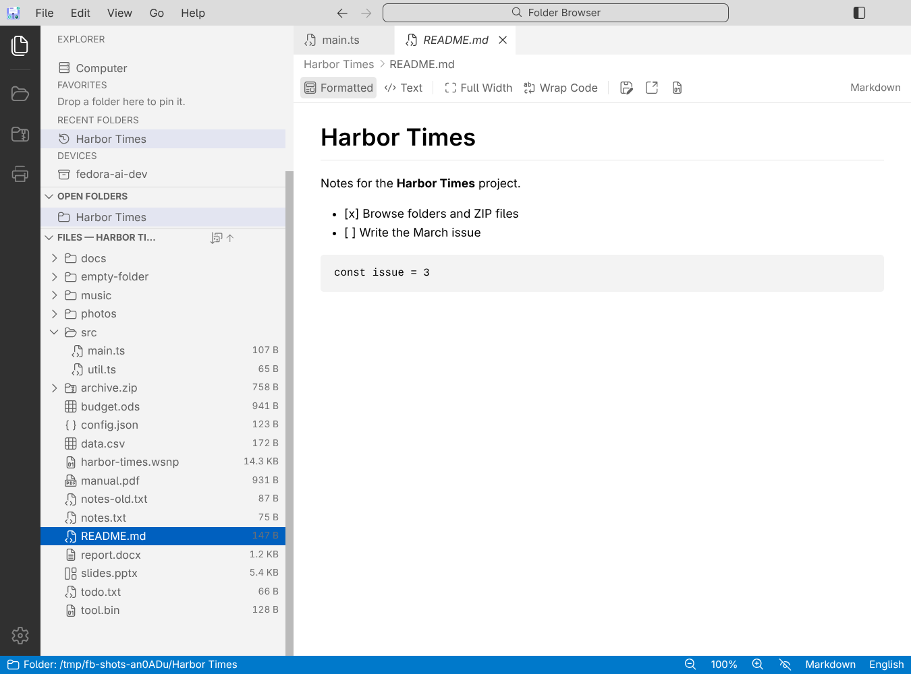

- **Arquivo ▸ Abrir Pasta…** (`Ctrl+Shift+O`, `⇧⌘O` no macOS), ou **arraste** uma pasta, um ZIP ou qualquer arquivo para a janela, ou diga um deles na linha de comando.
- Um **arquivo ZIP** abre como uma pasta, também um ZIP dentro de um ZIP. Um arquivo dito sozinho abre numa aba, com a pasta dele aberta ao lado.
- **Arquivo ▸ Abrir Arquivo…** (`Ctrl+O`) pede um arquivo; os instaladores registram `.wsnp` e `.zip` no aplicativo, então um duplo clique no gerenciador de arquivos também funciona.
- Quando o aplicativo inicia sem nada para abrir, ele **abre de novo o que estava aberto** (as pastas e as abas, na mesma ordem, com a mesma aba na frente): **Configurações ▸ Reabrir os arquivos que estavam abertos**; desligue e nada é guardado.
- As pastas abertas aparecem em **Pastas Abertas** na barra lateral; o × ao lado de uma fecha a pasta e as abas dela.

## A janela

Ela é organizada como o Visual Studio Code: uma **barra de título** com o menu, uma **barra de atividades**, uma **barra lateral**, **abas** com o caminho embaixo, o arquivo no meio e uma **barra de status**. `Ctrl+B` esconde e mostra a barra lateral; arraste a borda dela para mudar o tamanho.

- As **setas** da barra de título são **Voltar** e **Avançar** pelas abas que você visitou (`Alt+Esquerda`, `Alt+Direita`).
- A **caixa do meio** é **Ir para o Arquivo** (`Ctrl+E`): parte de um nome acha um arquivo dos snapshots abertos; sem nada digitado ela lista as suas abas, a mais recente primeiro. Digite `>` (ou aperte `Ctrl+Shift+P`) para a **paleta de comandos**, que tem todo comando que pode rodar agora e os temas de cor.

### A barra lateral

- **Lugares**: Home, Desktop, Documentos, Downloads, Música, Imagens, Vídeos, **Lixeira**, Computador (os que este computador tem), os **Favoritos** que você fixou, as **Pastas Recentes** e os **Dispositivos** montados. Um clique abre aquela pasta como a árvore. Fixe uma pasta com **Adicionar aos Favoritos** no menu dela, ou arraste uma pasta para os Favoritos; mova-os para cima e para baixo e remova-os pelo menu deles. **Limpar Pastas Recentes** está no menu dessa lista.
- **Arquivos**: a pasta que você escolheu, como uma árvore que lê um nível por vez (uma pasta com cem mil arquivos só é lida quando você a abre). Um **clique** abre uma **aba de visualização** (nome em itálico) que o próximo clique substitui; um **duplo clique** ou `Enter` a **mantém**. As setas movem, `→` e `←` abrem e fecham, e digitar pula para um nome.
- Os ícones do cabeçalho de Arquivos: **Novo Arquivo…**, **Nova Pasta…**, **Ordenar** (por nome, data ou tamanho, crescente ou decrescente; as pastas ficam primeiro), **Mostrar Arquivos Ocultos** (`Ctrl+H`) e **Atualizar**. Cada linha mostra o tamanho e a data da mudança, pequenos e à direita: com pouco espaço o que define a ordem, com a barra lateral larga os dois.
- **Arquivos ocultos** (nome que começa com ponto) são listados, mas só aparecem quando você pede: o olho, **Exibir ▸ Mostrar Arquivos Ocultos** ou as **Configurações**. Vale também para as entradas de um ZIP.
- O lugar **Lixeira** abre a lixeira do sistema como uma pasta (Linux e macOS): **Restaurar** devolve um item ao lugar de onde saiu (nunca por cima de algo que está lá agora) e **Esvaziar a Lixeira** apaga tudo de vez, depois de perguntar. No Windows abre a Lixeira.

### O menu do botão direito

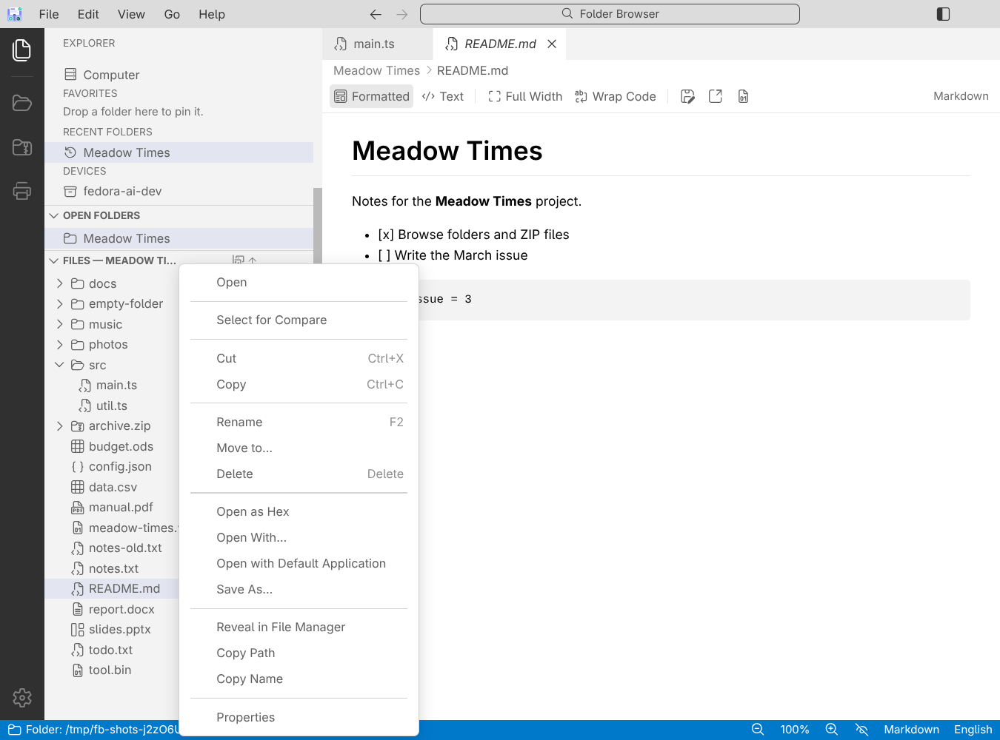

O menu de uma linha depende do que ela é. Uma pasta: expandir, atualizar, **Novo Arquivo…**, **Nova Pasta…**, **Renomear**, **Mover para…**, **Apagar**, adicionar aos Favoritos. Um arquivo ZIP: expandir, **Abrir como Lista**. Um `.wsnp`: **Abrir** (a página dele) ou **Abrir como ZIP**. Um arquivo: **Abrir** (ou **Tocar**); um arquivo de texto também **Selecionar para comparar** (e, escolhido outro, **Comparar com o selecionado**). **Para todo arquivo**: **Abrir como Hex**, **Abrir com…**, **Abrir com o Aplicativo Padrão**, **Salvar Como…**, **Mostrar no Gerenciador de Arquivos**, **Copiar Caminho**, **Copiar Nome**, **Propriedades**.

**Abrir com…** pergunta ao seu sistema qual aplicativo deve abrir o arquivo (o diálogo do Windows, o seletor do macOS, e no Linux um diálogo do próprio aplicativo, com os aplicativos registrados para o tipo primeiro, depois todos os outros, uma caixa de busca e **Sempre usar para este tipo de arquivo**). O aplicativo recebe uma **cópia somente leitura** na sua pasta temporária, removida quando o aplicativo fecha. Um tipo de arquivo que pode rodar como programa (`.exe`, `.bat`, `.sh`, `.desktop`, `.jar`…) nunca é entregue: use **Salvar Como…**.

## Criar, renomear, mover e apagar

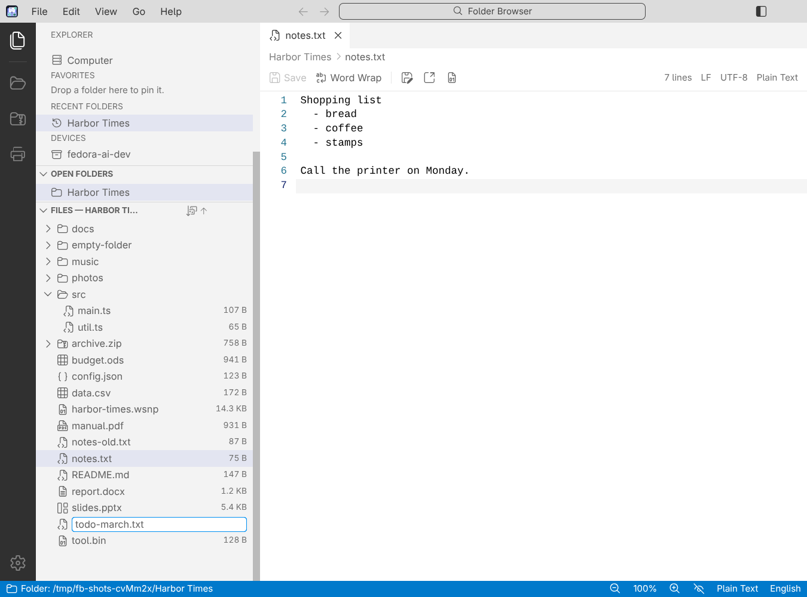

Isto vale para os arquivos e pastas de uma pasta que você abriu, e para o que há dentro de um arquivo ZIP (veja "Dentro de um ZIP" abaixo); não vale no lugar Lixeira.

- **Novo Arquivo…** e **Nova Pasta…** (os ícones do cabeçalho de Arquivos, o menu de uma pasta, ou a parte vazia embaixo da árvore para a raiz) colocam um campo na árvore: digite o nome e aperte `Enter` (`Esc` desiste). O item novo é criado onde está o foco: na pasta que o tem, ou na pasta do arquivo que o tem, ou na raiz.
- **Renomear** (`F2`, ou o menu) edita o nome na própria linha, com o nome sem a extensão selecionado. `Enter` renomeia; `Esc`, ou sair do campo, desiste.
- **Mover para…** abre um seletor com as pastas da raiz; uma pasta nunca é oferecida a ela mesma nem ao que há nela, nem a pasta em que o item já está. **Arraste** uma linha para uma pasta, ou para a parte vazia embaixo da árvore (a raiz), para movê-la para lá; um arquivo solto sobre outro arquivo vai para a pasta em que esse arquivo está. Uma pasta fechada **abre sozinha** quando você segura o item sobre ela por um instante, e assim por diante, para chegar a uma pasta funda num só arrasto. Aperte **Shift** durante o arrasto (antes de soltar) para **copiar** em vez de mover: o ponteiro muda, o original fica, e uma cópia que teria o mesmo nome é numerada (`a (2).txt`), então soltar com Shift sobre uma linha da pasta em que o item está faz uma duplicata. Nada é substituído.
- **Apagar** (`Delete`, ou o menu) pergunta e move o item para a **lixeira** (uma pasta com tudo o que há nela). Para apagá-lo **definitivamente**, aperte **`Shift+Delete`**, ou segure **Shift** ao escolher **Apagar** no menu, ou enquanto a pergunta está na tela: ela muda para "Apagar definitivamente?" e volta quando você solta. Isso não pode ser desfeito. Se a lixeira não puder receber um item, você é perguntado de novo se quer apagá-lo definitivamente.
- **Nada é substituído.** Um nome já usado é recusado, com palavras, e o campo fica para você digitar outro. Um nome que nenhum arquivo pode ter (vazio, `.` ou `..`, com `/` ou `\`, caracteres de controle, mais de 255 bytes; no Windows também `< > : " | ? *`, os nomes que o sistema reserva como `CON` ou `NUL`, e um nome terminado em espaço ou ponto) é recusado antes de perguntar qualquer coisa. Uma pasta nunca é movida para dentro dela mesma. Nada sai da pasta que você abriu: um link simbólico é renomeado, movido ou apagado como o link, nunca o que ele aponta.
- As **abas acompanham**: a aba de um arquivo renomeado ou movido (ou de um arquivo de uma pasta renomeada) mantém o lugar, o zoom e a visualização, com o nome novo, e a aba de um item apagado fecha.

## Várias linhas, Recortar, Copiar e Colar

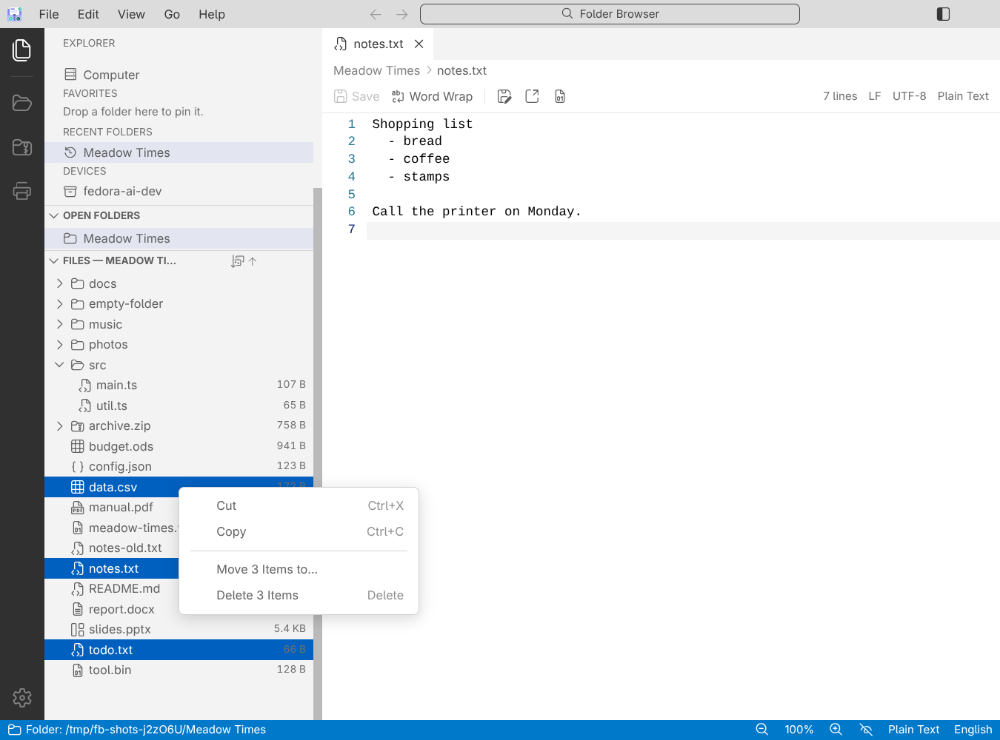

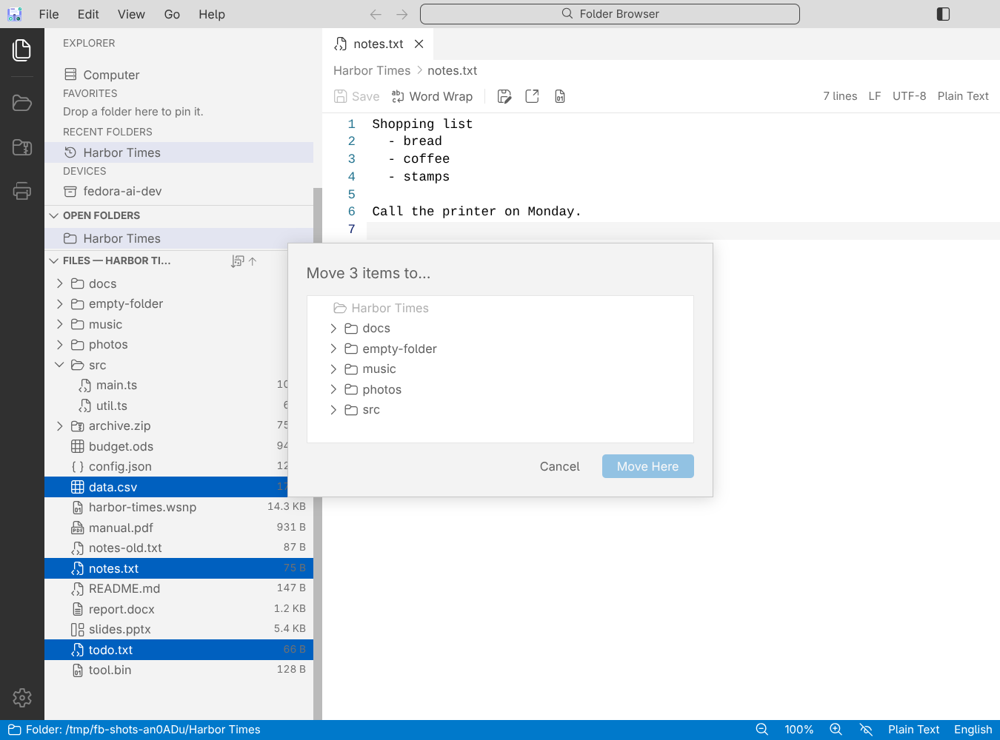

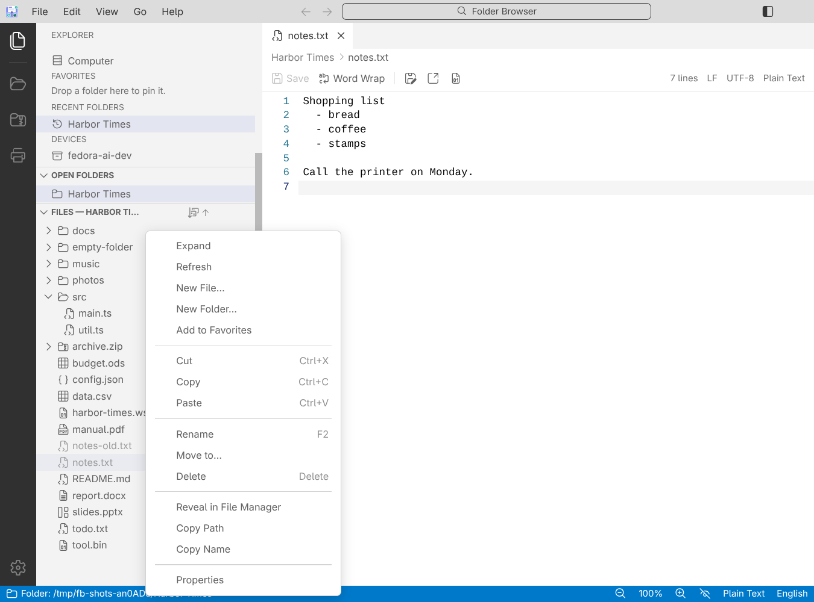

- **Marcar várias linhas** na árvore: **Ctrl+clique** (`⌘+clique` no macOS) marca ou desmarca uma linha, **Shift+clique** marca tudo desde a linha em que você clicou por último até esta, **Shift+↑ / ↓** (também `Shift+Home` / `End`) estende as marcas a partir de onde começaram, e **Ctrl+A** (`⌘A`) marca todas as linhas da tela. As linhas marcadas ficam destacadas. Um clique com Ctrl ou Shift só marca (nada abre). Um clique simples, uma seta simples ou **Esc** soltam as marcas, e uma marca some com a sua linha (quando ela é apagada ou a pasta dela é fechada).
- **Uma ação sobre uma linha marcada vale para todas**, de uma vez: **Apagar** (uma pergunta para todas; `Shift+Delete` pede o apagar definitivo), **Mover para…** (um seletor de pastas), **arrastar** uma delas para uma pasta (vão juntas; com **Shift** apertado são copiadas) e, para exatamente dois arquivos de texto, **Comparar os Selecionados**. O menu de clique direito de uma linha marcada vale para todas as marcadas e diz quantas são. Se uma pasta e algo dentro dela estão marcados, só a pasta recebe a ação. Quando algo não pode ser feito com algumas delas, uma mensagem diz quantas e o que deu errado primeiro; o resto é feito. Isto vale também dentro de um ZIP.
- **Recortar, Copiar e Colar** (`Ctrl+X`, `Ctrl+C`, `Ctrl+V`; `⌘X`, `⌘C`, `⌘V` no macOS; também **Recortar**, **Copiar** e **Colar** no menu de clique direito de um arquivo, de uma pasta, de linhas marcadas e da parte vazia da árvore) valem para os arquivos e pastas da árvore: para as linhas marcadas, ou para a linha que tem o foco. **Colar** põe na pasta (ou arquivo ZIP) que tem o foco, ao lado do arquivo que o tem, ou na pasta de cima. Uma **cópia** colada é numerada quando o nome já existe (`a (2).txt`), então Copiar e Colar na mesma pasta faz uma duplicata, e nada é substituído; um **recorte** colado move, uma vez só, e as linhas recortadas ficam esmaecidas até lá. A área de transferência é a do próprio aplicativo (não toca a do sistema), vale na pasta que foi aberta e dentro de um ZIP, e entre duas pastas abertas, ou entre uma pasta e um ZIP, diz que ainda não pode. Num campo de nome e no editor as teclas são as de sempre.

## O que uma aba pode mostrar

| Arquivo | O que você vê |
| --- | --- |
| Código, texto e dados: HTML, CSS, JavaScript, TypeScript, JSON, XML, YAML, TOML, INI, `.env`, shell, SQL, Dockerfile, e código em Python, C, C++, C#, Java, Kotlin, Scala, Go, Rust, Swift, Dart, PHP, Ruby, Perl, Lua, R, Groovy, Haskell, Julia, Clojure, Erlang, Pascal, PowerShell, CMake, Diff, Protocol Buffers, SCSS, Sass, Less, texto simples | Código com cores e números de linha. Um arquivo de texto **de uma pasta que você abriu é editado** (veja "Editar texto"); um texto de um snapshot, ou que não pode ser editado, é somente leitura, e um HTML, CSS, JavaScript, JSON ou XML minificado ou de uma linha só é então mostrado **organizado** (o botão **Formatar** o mostra como foi salvo; Salvar Como sempre grava o arquivo como foi salvo). **Quebra de Linha** quebra linhas longas (`Alt+Z`). As duas escolhas são guardadas e estão nas Configurações. Texto acima de 5 MB não abre numa aba; um **`.log`** abre até 32 MB. |
| Um arquivo de um tipo que o aplicativo não conhece | Mostrado como texto quando o que há nele é texto; senão, como os bytes (hexadecimal). |
| Markdown (`.md`) | Uma **página formatada** (títulos, listas, tabelas, código; um link da web abre no seu navegador; uma imagem não é carregada e o HTML escrito dentro aparece como texto), com os botões **Formatado / Texto**; **Largura Total** e **Quebrar Código**. |
| CSV e TSV | Uma **tabela** com ordenação, filtros, busca, consulta SQL e edição: veja [Tabelas](#tabelas-csv-e-tsv). Os botões **Tabela / Texto** passam para o código. |
| Imagens | A imagem com uma **barra de ferramentas**: diminuir e aumentar, uma caixa (Ajustar, Ajustar à Largura, Ajustar à Página, 25 % a 400 %…), tamanho real, **Salvar Como…**. `Ctrl` e a roda dão zoom ao redor do ponteiro. |
| SVG | Uma imagem no início, com os botões **Imagem / Código** para o código. |
| PDFs | As páginas com texto selecionável, uma barra de ferramentas com o mesmo zoom, página anterior e seguinte, uma caixa para ir a uma página. Ainda não: links e formulários dentro do PDF, e senhas. |
| Fontes | Uma amostra em vários tamanhos. |
| **Documentos de escritório**: Word (`.docx`), PowerPoint (`.pptx`), LibreOffice e OpenDocument (`.odt`, `.ods`, `.odp`, `.odg`), Excel (`.xlsx`, `.xls`), e os antigos `.doc` e `.ppt` | Desenhados **como uma página** por bibliotecas prontas (docx-preview, pptx-renderer e odr-core), num quadro que não tem rede e não alcança o resto da janela, de modo que um arquivo hostil, no máximo, se desenha mal. Uma planilha mostra uma aba por vez, com uma barra de nomes. Até 48 MB. Fontes que o documento pede e o computador não tem são trocadas, gráficos são aproximados e nada se anima. Um arquivo que não pode ser desenhado diz por quê, com **Salvar Como…** e **Ver em hexadecimal**. Um documento já desenhado é mantido enquanto você olha outra aba. |
| **Bytes**: programas e bibliotecas (`.exe`, `.dll`, `.so`, `.o`, `.class`, `.wasm`…), imagens de disco, bancos de dados, e qualquer arquivo de tipo desconhecido que não seja texto | **Visualização hexadecimal**: a posição, 16 bytes em hex (oito e oito) e os mesmos bytes como texto. Clique num byte (`Shift`+clique ou as setas para estender); `Ctrl+C` copia os bytes como hex (a barra de ferramentas também copia como texto); **Ir para a posição** aceita hex, `0x…` ou `#decimal`; **Localizar** procura bytes ou texto, para frente e para trás, no arquivo todo (`Ctrl+F` vai para a caixa dele). A barra de ferramentas diz o que é o cabeçalho (ELF, PE, Mach-O, classe Java, ZIP, PDF, PNG, SQLite…) lendo-o, nunca executando o arquivo. Um arquivo de uma pasta, de qualquer tamanho, é lido uma janela por vez. Qualquer arquivo pode ser aberto assim: **Abrir como Hex** no menu, ou **Ver em hexadecimal** na barra de ferramentas. |
| Um vídeo ou um som | **Tocado** numa aba com o player do próprio navegador (tocar, buscar, volume, velocidade, repetir, tela cheia para vídeo, Anterior e Próximo pela mídia da pasta; as teclas de mídia do sistema funcionam; continua tocando quando outra aba está na frente). Também de dentro de um ZIP e de um snapshot. O que o navegador não decodifica (HEVC…) é dito, com **Abrir com…** e **Salvar Como…**. |
| Arquivos ZIP | A **lista de arquivos** (veja abaixo). |
| Um `.wsnp` | A **página que ele guarda** (veja abaixo). |
| Qualquer outra coisa (um arquivo grande demais) | Um cartão com o nome, o tipo e o tamanho, e **Salvar Como…**, **Abrir com…** e **Ver em hexadecimal**. |

**Abrir com…** e **Ver em hexadecimal** estão na barra de ferramentas do documento, da tabela, dos bytes e de todo texto, e nos cartões.

Algumas das visões, na pasta usada para estas imagens:

| | |
| --- | --- |
| 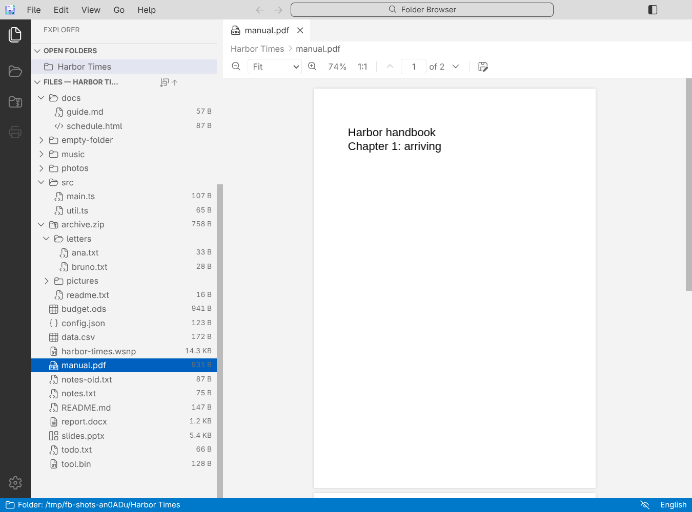 | 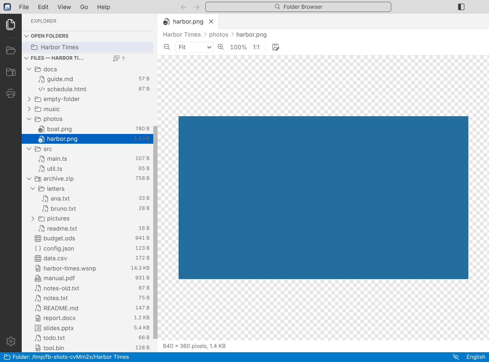 |
| 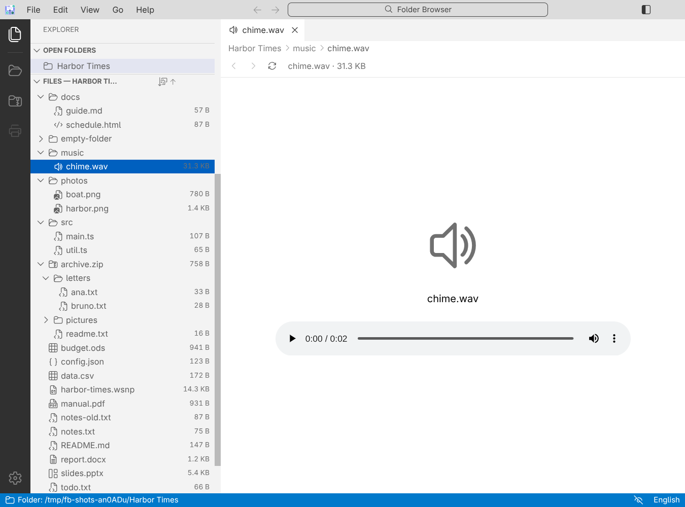 | 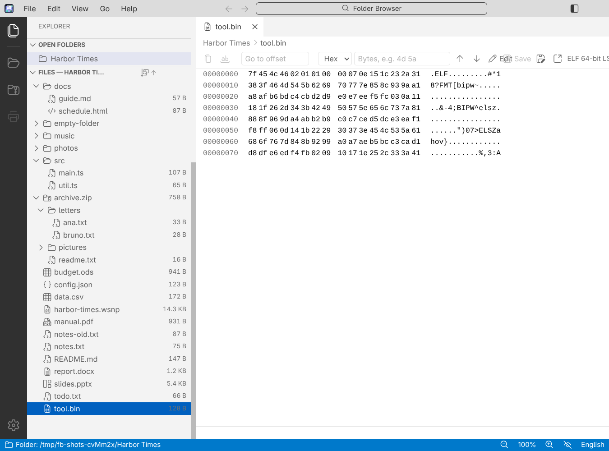 |
| 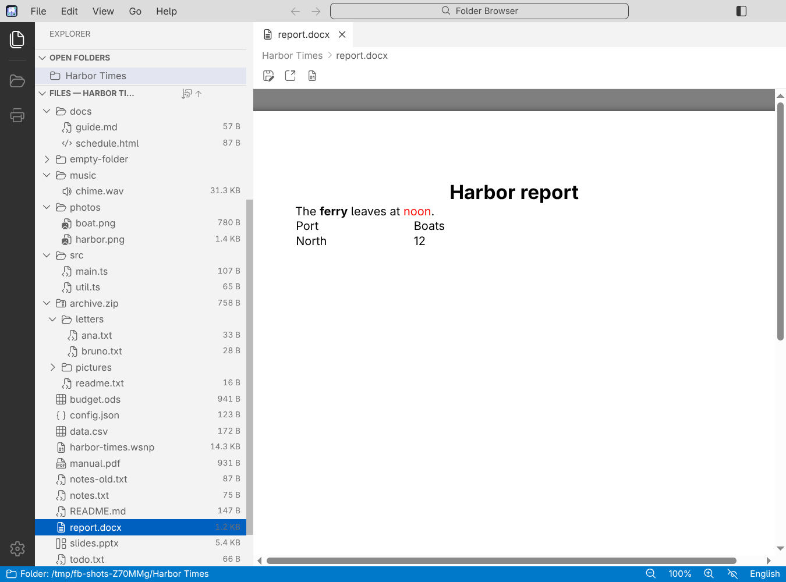 | 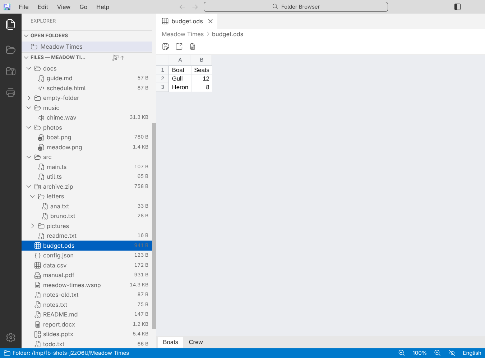 |

## Editar texto

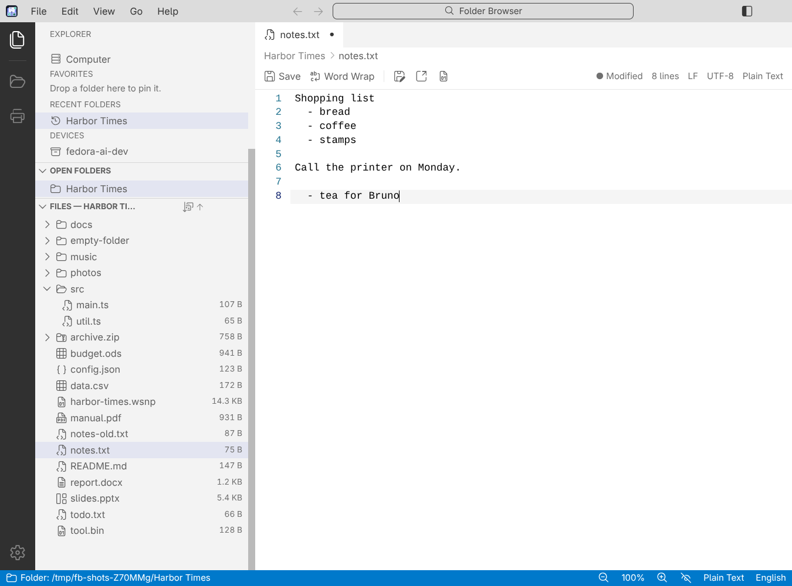

Um arquivo de texto de uma pasta que você abriu, ou de dentro de um ZIP, abre pronto para editar, com as cores da linguagem, desfazer e refazer (`Ctrl+Z`, `Ctrl+Shift+Z`), fechamento automático de colchetes, `Tab` para indentar e Quebra de Linha.

- **Salvar** com `Ctrl+S` (`⌘S`), o botão **Salvar** da barra de ferramentas, ou **Arquivo ▸ Salvar**; **Salvar Tudo** (`Ctrl+Alt+S`, `⌘⌥S`) grava todas as abas com alterações. Uma aba com alterações mostra um **ponto** no lugar do × (o × volta quando o ponteiro está sobre a aba), e a barra de ferramentas diz **● Modificado**.
- O arquivo é gravado **inteiro e com segurança**: num arquivo temporário ao lado, depois renomeado sobre ele, com as permissões mantidas, de modo que uma falha ou um disco cheio deixa o arquivo antigo. As **terminações de linha** (LF, CRLF ou CR, mostradas na barra de ferramentas) e a **marca de ordem de bytes** (UTF-8 com BOM) são mantidas, então um arquivo que você abre e salva sem mudar fica com os mesmos bytes. Um arquivo cujas linhas terminam em estilos misturados fica uniforme ao salvar.
- Se o arquivo **mudou no disco** desde que você o abriu (outro programa o gravou), Salvar não grava: pergunta se **Sobrescrever** com o seu texto ou **Carregar do Disco** (as suas alterações se perdem). Cancelar deixa tudo como está.
- **Fechar uma aba** com alterações pergunta **Salvar / Não Salvar / Cancelar**, também para Fechar Todas, Fechar Outras e fechar a pasta; **fechar a janela** também pergunta, para todas as abas com alterações. As alterações e o histórico de desfazer ficam com a aba enquanto você olha outra, e a acompanham se você renomear ou mover o arquivo.
- **Formatar Documento** (HTML, CSS, JavaScript, JSON, XML) organiza o texto para leitura como uma edição que **pode ser desfeita**. **Salvar Como…** grava o texto da tela num arquivo que você escolhe. Uma página Markdown formatada ou uma tabela CSV do mesmo arquivo mostra o que você digitou, salvo ou não.
- Só se edita **texto UTF-8 de até 5 MB**. Um arquivo em outra codificação, um binário, um arquivo maior, os arquivos de um snapshot e os arquivos de um ZIP que não pode ser regravado (veja "Dentro de um ZIP") são mostrados, não editados, e a barra de ferramentas diz por quê.

- **As alterações não salvas são guardadas.** O que você digitou (ou mudou nos bytes) fica num rascunho na pasta do próprio aplicativo logo depois que você para. Se você fechar a janela ou sair, nada é perguntado: na próxima vez a aba volta **com as suas alterações, marcada como modificada**, e uma mensagem avisa. Salvar grava como sempre (e ainda percebe um arquivo que mudou no disco nesse meio-tempo). **Configurações ▸ Manter alterações não salvas** desliga isso: a janela volta a perguntar Salvar / Não Salvar ao fechar, e os rascunhos são apagados.
- **Editar bytes.** Numa aba hex (qualquer arquivo: **Abrir como Hex**, ou **Ver em hexadecimal** num texto), o botão **Editar** torna os bytes editáveis. Clique num byte e digite **dígitos hexadecimais** (dois por byte; os bytes alterados ficam em negrito), ou clique na coluna de texto e digite caracteres. **Insert** alterna entre sobrescrever (`OVR`) e inserir (`INS`); **Delete** e **Backspace** removem o byte ou a seleção; depois do último byte dá para acrescentar mais. `Ctrl+Z` / `Ctrl+Y` desfazem e refazem; **Salvar** funciona como no texto. Só se editam arquivos de uma pasta de até 16 MiB; arquivos maiores e os de um ZIP ou de um snapshot são só vistos.

## Tabelas (CSV e TSV)

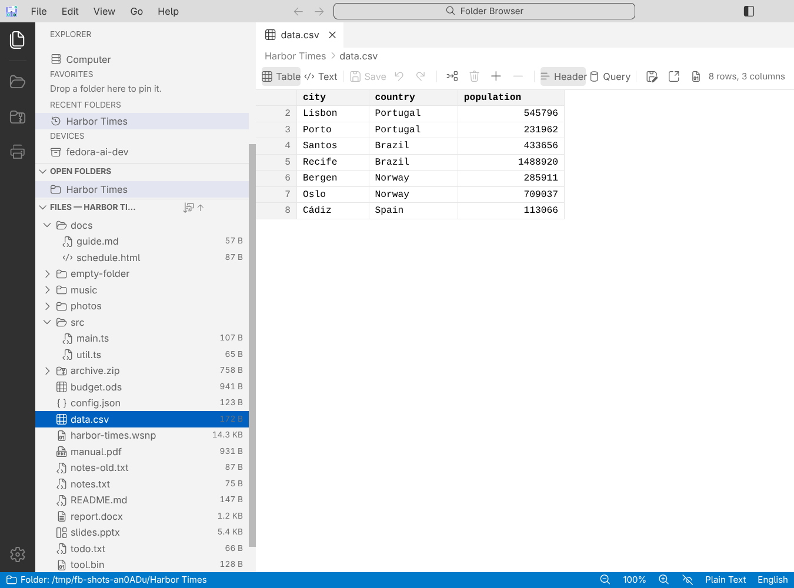

Um arquivo CSV ou TSV abre como **tabela** (**Tabela / Texto** na barra de ferramentas passam para o código; a escolha é lembrada). A primeira linha é o cabeçalho e fica à vista; as linhas são numeradas com a linha delas no arquivo; o delimitador (vírgula, ponto e vírgula, tab, barra) é achado sozinho. Só as linhas à vista são desenhadas, então um arquivo de centenas de milhares de linhas rola na hora (até 500.000 linhas e 500 colunas; dito quando corta).

- **Ordenar**: a seta no cabeçalho de uma coluna a ordena para cima, depois para baixo, depois volta à ordem do arquivo. Números e datas ISO são ordenados como tais (o tipo é achado pelos valores), o texto do jeito que as pessoas ordenam (`item 2` antes de `item 10`), e células vazias sempre por último. Ordenar nunca muda o arquivo.
- **Filtrar**: o funil no cabeçalho abre um painel com uma condição (contém, é igual a, começa com, é maior que, está vazio…) e um valor, ou os **valores distintos da coluna para marcar**, com quantas linhas têm cada um. Filtros de várias colunas se somam; **Limpar Filtros** mostra todas as linhas de novo. A barra diz "2 de 4 linhas".
- **Buscar**: `Ctrl+F` marca as células que têm o texto, passa de uma a outra com Enter e `Shift+Enter`, e seleciona a célula em que está.
- **Cabeçalho**: o botão **Cabeçalho** diz se a primeira linha tem os nomes das colunas (desligado, as colunas são A, B, C…).
- **Consulta**: o botão **Consulta** abre uma caixa para um `SELECT` SQL sobre a tabela, chamada `t`, cujas colunas têm o nome do cabeçalho (`SELECT Tipo, count(*) FROM t GROUP BY Tipo`; um nome com espaços vai entre aspas duplas; `rowid` é o número da linha). Números são comparados como números, células numéricas vazias são NULL. `Ctrl+Enter` executa. As linhas do resultado tomam o lugar da tabela (**Mostrar Todas as Linhas** volta) e **Exportar Resultado** as salva como CSV. Só uma instrução, só um `SELECT` ou `WITH`: nada no arquivo é alterado por uma consulta, e uma que passe de dez segundos é interrompida. O SQLite roda dentro do aplicativo, num worker; nada é enviado a lugar nenhum.
- **Editar células** (arquivo de uma pasta): clique numa célula e aperte `Enter`, `F2` ou simplesmente digite; o duplo clique faz o mesmo. `Enter` guarda o texto e desce, `Tab` guarda e vai para a direita, `Esc` desiste, `Alt+Enter` começa uma nova linha na célula. `Delete` esvazia a célula. Os nomes do cabeçalho se editam do mesmo jeito. **Adicionar Linha**, **Apagar Linha**, **Adicionar Coluna** e **Apagar Coluna** (a barra de ferramentas, ou o menu do botão direito de uma célula) agem sobre a célula selecionada; `Ctrl+Z` e `Ctrl+Y` desfazem e refazem, uma ação por vez.
- Uma célula que você edita é uma mudança **do texto do arquivo**, exatamente naquela célula: todo o resto fica byte a byte como estava (aspas, fins de linha, a marca de ordem de bytes); um valor que precisa de aspas as recebe. Assim o ponto na aba, **Salvar** (`Ctrl+S`), a conferência contra um arquivo que mudou no disco e as alterações guardadas para a próxima vez são as do editor de texto, e o botão **Texto** mostra o mesmo texto. Um arquivo com mais linhas ou colunas do que são desenhadas, um arquivo de um ZIP ou de um snapshot e o resultado de uma consulta são só vistos.

## Comparar dois arquivos de texto

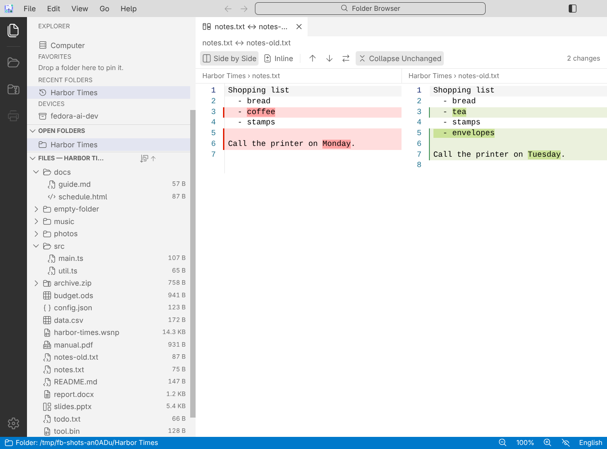

Clique com o botão direito num arquivo de texto da árvore e escolha **Selecionar para comparar**; depois clique com o direito em outro e escolha **Comparar com o selecionado**: os dois abrem numa só aba, `a.txt ↔ b.txt`, o primeiro como o lado esquerdo. Qualquer um pode ser um arquivo de uma pasta ou uma entrada de um ZIP (também dentro de outro ZIP), da mesma pasta aberta ou de duas diferentes; a escolha fica, então mais arquivos podem ser comparados com o mesmo primeiro. Só se compara um texto em UTF-8 de até 5 MB; o resto é recusado com o nome e o motivo.

- **Lado a lado** e **Em linha** (uma coluna, com as linhas removidas acima das acrescentadas) mudam a disposição; a escolha é lembrada. As cores da linguagem de cada arquivo continuam, as linhas removidas ficam vermelhas e as acrescentadas verdes, e as palavras que mudaram dentro de uma linha são marcadas com mais força.
- A barra de ferramentas diz quantas alterações há. **Alteração anterior** e **Próxima alteração** (`Shift+F7`, `F7`) vão de uma à outra; **Trocar os lados** inverte os dois.
- **Recolher o que não mudou** dobra os trechos longos de linhas iguais (três linhas ficam em volta de cada alteração); o botão desliga, e a escolha é lembrada.
- Um arquivo salvo com outra quebra de linha (`LF` e `CRLF`) não é diferente em todas as linhas: as quebras não entram na comparação, e a barra de ferramentas avisa quando diferem.
- Você também pode **arrastar** um arquivo de texto da árvore para o meio do editor, para uma aba ou para outro arquivo da árvore para compará-los: veja [Dois grupos de editor](#dois-grupos-de-editor).
- Uma comparação só olha: nada é gravado, e os dois arquivos são lidos do disco (ou do ZIP) como estão salvos, não com as alterações ainda não salvas nas abas deles. A aba acompanha um lado que é renomeado ou movido, fecha quando um lado é apagado ou a pasta dele é fechada, tem zoom como um texto (`Ctrl+=`, `Ctrl+-`) e não é lembrada no próximo início. **Buscar** (`Ctrl+F`) procura nas linhas à vista.

## Dois grupos de editor

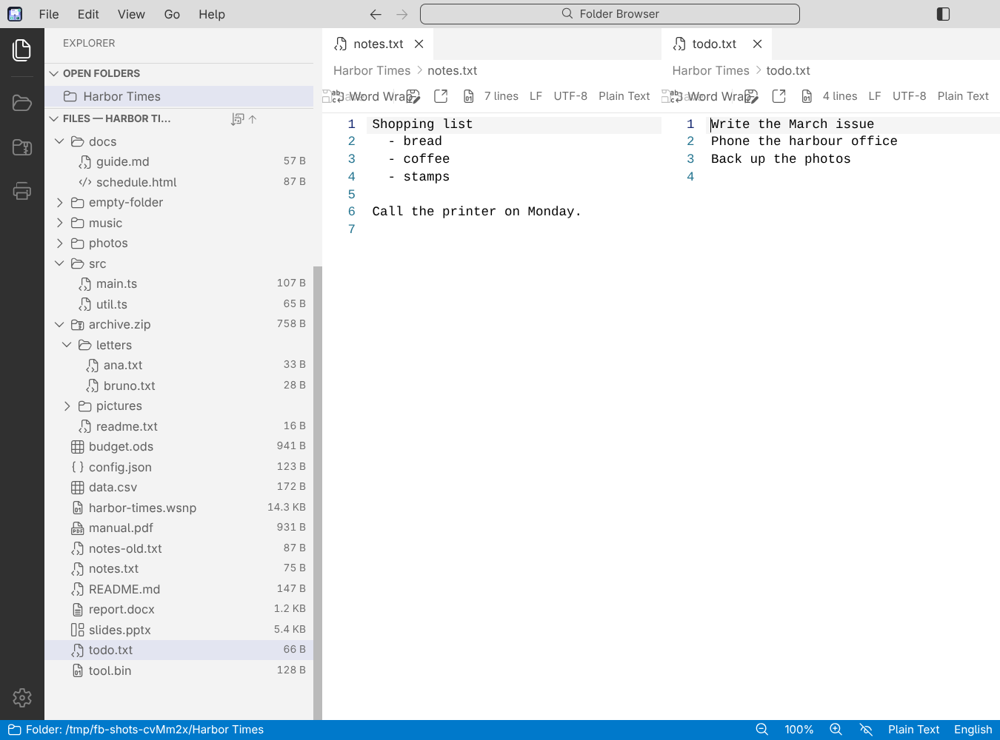

O editor pode mostrar **dois grupos de abas lado a lado**, como o VS Code. Há três jeitos de fazer o segundo: **Dividir à direita** no menu de uma aba (a aba vai para um grupo novo à direita dela), arrastar uma aba para a **metade direita do editor**, e arrastar um **arquivo da árvore** para a metade direita (ele abre ali). Enquanto um desses é arrastado, a metade que vai recebê-lo fica destacada; com dois grupos, o grupo inteiro sob o ponteiro o recebe. Uma aba volta com **Mover para o grupo da esquerda** ou arrastando-a para o outro grupo (sobre uma aba dele, ela fica ao lado dessa aba).

- Cada grupo tem as suas abas e a sua aba da frente. O grupo em que você clicou por último tem o foco: **Buscar**, **Copiar**, **Imprimir**, **Salvar**, o idioma na barra de status, as teclas de zoom e a aba seguinte e anterior (`Ctrl+PageDown`, `Ctrl+PageUp`) agem nele. Uma aba é um arquivo, então ela está em um grupo de cada vez: abrir um arquivo que está no outro grupo o traz para cá.
- O segundo grupo termina quando a última aba dele é fechada ou levada embora; fechar todas as abas do primeiro deixa o segundo como único grupo. A disposição é lembrada no próximo início.
- **Soltar um arquivo sobre outro** pergunta o que fazer quando os dois são textos: **Abrir lado a lado** (o que você arrastou à esquerda, o outro à direita), **Comparar (Diff)** ou Cancelar. Vale para um **arquivo de texto da árvore solto no meio do editor** que mostra um arquivo de texto (os 40 % do meio ficam destacados, com "Solte aqui para comparar, ou para abrir lado a lado"), **no meio de uma aba de texto**, ou **sobre outro arquivo de texto da árvore** (nada é movido, e com `Shift` apertado continua sendo uma cópia); ou uma **aba** solta no meio do editor ou de outra aba de texto. O arquivo que você arrasta é o lado esquerdo. Solto à **direita** do editor (ou à esquerda), o arquivo só abre, no grupo daquele lado; solto na borda de uma aba, abre no grupo dela (uma aba só é reordenada). Uma imagem ou outro tipo de arquivo nunca é perguntado.

## Arquivos ZIP

Um arquivo ZIP abre na árvore como uma pasta, e as entradas abrem em abas como arquivos. **Abrir como Lista** mostra as entradas como uma tabela de nomes, tamanhos, tamanhos compactados e datas, onde você pode selecionar (clique, `Ctrl` e `Shift`, as caixas, `Ctrl+A`) e **Extrair** para uma pasta: um arquivo pede um nome, **Extrair Tudo…** grava tudo, e um arquivo que já existe nunca é sobrescrito (o novo se chama `nome (2)`). Nada é gravado no disco até você extrair. Nomes que poderiam sair da pasta escolhida nunca são gravados, links não são seguidos, e uma entrada protegida por senha aparece esmaecida e é pulada. Um ZIP acima de 256 MB só é oferecido com Salvar Como. ZIP64 e ZIPs criptografados são somente leitura.

## Dentro de um ZIP

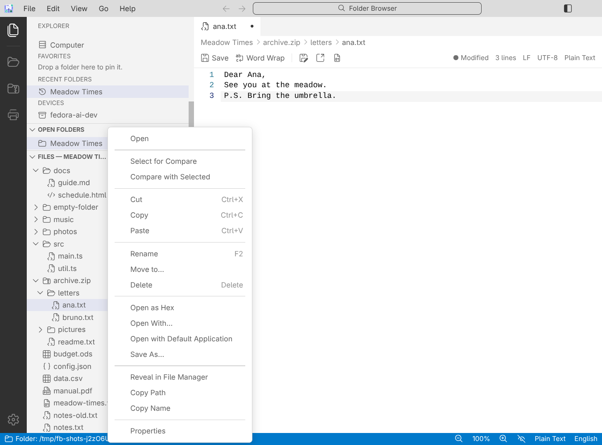

Um arquivo ZIP, também um ZIP dentro de um ZIP, é alterado como uma pasta, e o que você altera é gravado de volta no arquivo ZIP.

- **Novo Arquivo…** e **Nova Pasta…** funcionam no menu de um arquivo ZIP (criam o item no topo dele) e das pastas dele; **Renomear** (`F2`), **Mover para…** (ou um arrasto sobre uma pasta do mesmo ZIP), a **cópia com Shift** (numerada quando o nome já existe) e **Apagar** funcionam nas entradas. Um ZIP não tem lixeira, então **Apagar** pergunta "Apagar definitivamente?" logo de cara, e isso não pode ser desfeito. Uma pasta que você esvazia continua no ZIP, como num disco. Nada é substituído, e uma pasta nunca vai para dentro dela mesma.
- Uma **entrada de texto abre pronta para editar**, como um arquivo de uma pasta (veja "Editar texto"): **Salvar** (`Ctrl+S`) grava o ZIP de novo. Se outro programa mudou essa mesma entrada enquanto isso, Salvar pergunta **Sobrescrever** ou **Carregar do Disco**; uma mudança em outra entrada do ZIP não é um conflito.
- O ZIP é **regravado inteiro e com segurança**: as entradas que você não tocou são copiadas como estavam (compactadas ou só armazenadas, com as datas e permissões) para um arquivo temporário ao lado do ZIP, e o arquivo só é renomeado sobre ele quando está completo, então uma queda ou um disco cheio deixa o ZIP antigo. Se outra coisa mudou o ZIP enquanto ele era gravado, nada é gravado e você é avisado para tentar de novo. Um ZIP grande leva um instante a cada alteração. Um ZIP dentro de um ZIP é tirado para um arquivo temporário, alterado e colocado de volta.
- Um ZIP que **não pode ser regravado fielmente** é mostrado mas não alterado, e diz por quê: ZIP64, uma entrada criptografada, um método de compressão que não seja armazenado ou DEFLATE, um nome que poderia sair da pasta em que é extraído (`..`, um caminho absoluto, uma barra invertida), duas entradas com o mesmo nome, ou mais de 100.000 entradas. Um `.wsnp` nunca é alterado por dentro (editar quebraria a assinatura dele); o arquivo inteiro pode ser renomeado, movido ou apagado. Nomes numa codificação antiga são gravados de volta em UTF-8.
- **Nada se move entre uma pasta e um arquivo ZIP, nem de um arquivo ZIP para outro**: o arrasto ou o **Mover para…** é recusado, com palavras, e os dois ficam como estavam. O arquivo ZIP em si é renomeado, movido e apagado (para a lixeira) como qualquer arquivo da pasta dele. Os bytes de uma entrada só são vistos na visão hexadecimal.

## Zoom, Localizar, Copiar e Imprimir

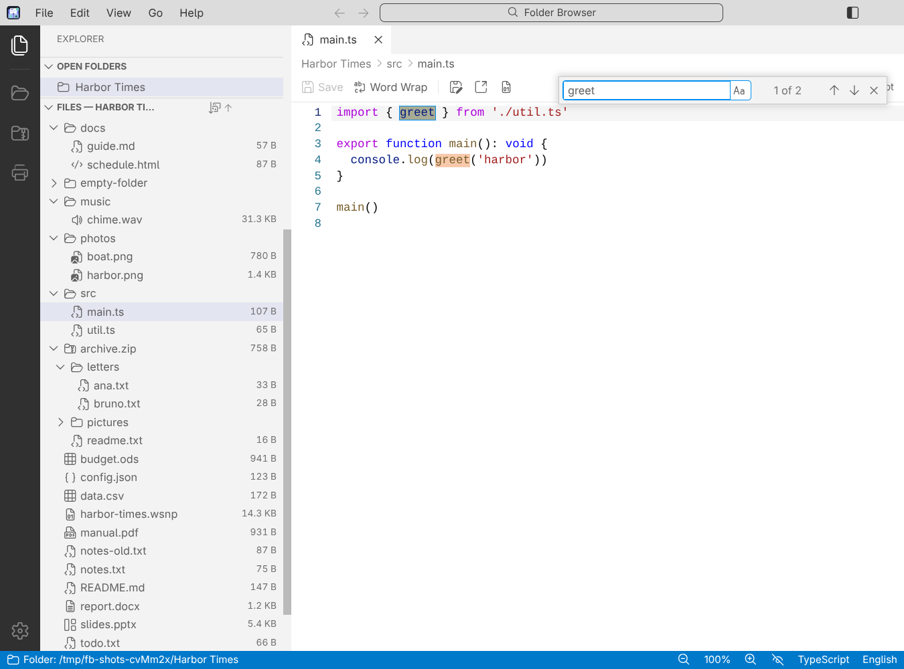

- O **zoom** pertence à **aba**, nunca ao aplicativo todo. `Ctrl+=`, `Ctrl+-` e `Ctrl+0` (`⌘` no macOS), ou `Ctrl` e a roda (também sobre um documento ou uma página), dão zoom na página de um snapshot, num texto, numa tabela, num documento e nas linhas da visualização hexadecimal (25 % a 500 %). A **barra de status** tem **−**, o nível (clique nele para voltar a 100 %) e **+**. Uma imagem e um PDF guardam o zoom deles (as mesmas teclas o variam). Cada aba tem o seu; uma aba fechada o esquece.
- **Localizar** (`Ctrl+F`, **Editar ▸ Localizar**) funciona em toda aba que tem texto: um arquivo de código (no texto todo), uma tabela, um PDF, um documento (no quadro dele; numa planilha, a aba na tela), os metadados e as listas. A caixa diz qual ocorrência de quantas; `Enter` e `Shift+Enter` vão para a próxima e a anterior, **Aa** diferencia maiúsculas, `Esc` fecha. Nos bytes de um arquivo `Ctrl+F` vai para a caixa que procura bytes ou texto.
- **Copiar** (`Ctrl+C`) copia o que está selecionado.
- **Imprimir** (`Ctrl+P`, **Arquivo ▸ Imprimir…**, ou o ícone da impressora) imprime um texto como a aba o mostra, uma imagem, a página de um snapshot e um **documento inteiro** (toda planilha, todo slide). **Salvar como PDF…** grava o mesmo como PDF. A lista de um ZIP, um PDF, uma tabela e os bytes de um arquivo ainda não podem ser impressos.

## Arquivos `.wsnp`

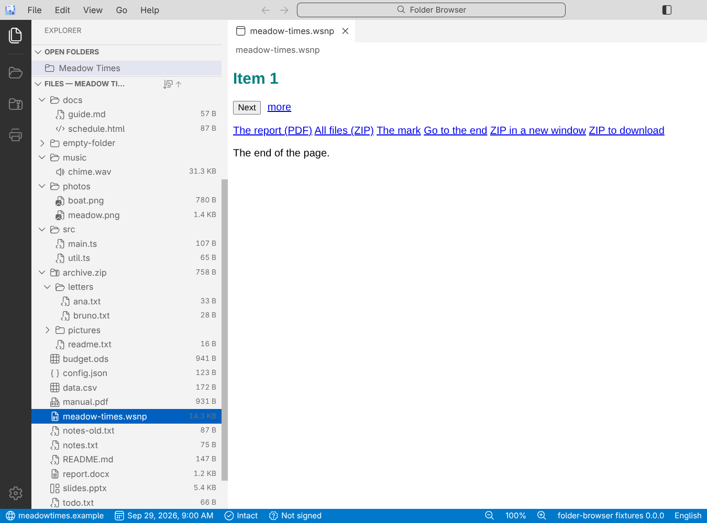

Um `.wsnp` é uma "foto" em ZIP de uma página da web para ler offline: a página, todos os arquivos de que ela precisa e um manifesto. No Folder Browser ele é **um arquivo como os outros** na árvore: um clique mostra a página numa aba de visualização, um duplo clique a mantém, e **Abrir como ZIP** lista as entradas. A página roda como o formato manda (carrosséis, menus), num quadro sem rede. Os links nela abrem numa aba (uma imagem, um PDF, código, um ZIP como lista), ou no seu navegador para um endereço da web, só quando você clica. A **barra de status** diz o que a verificação achou, e a aba **Metadados** (pelo menu da aba ou pela barra de status) mostra o que o manifesto diz. Os arquivos dentro de um snapshot abrem pelos links dele, pelos metadados e por Ir para o Arquivo. Para algo a mais (uma árvore dos arquivos dele, exportar), use **Abrir com…** e entregue-o ao [WSNP Viewer](https://github.com/asantos43/wsnp-viewer).

O arquivo é verificado quando abre, e de novo em segundo plano: a **estrutura**, o **SHA-256 e o tamanho de cada arquivo** contra o manifesto, e a **assinatura**. Se um arquivo não é o que o manifesto diz, ou um manifesto assinado foi editado, o snapshot **não é válido** e a página dele não aparece até você escolher **Mostrar Mesmo Assim**. O PageKeep assina o que grava; o signatário aparece como uma impressão digital, e **Confiar neste signatário** nos metadados lembra uma chave que você sabe ser sua (projeto: [`MANIFEST-SIGNING.md`](MANIFEST-SIGNING.md)). Um ZIP salvo por um PageKeep antigo abre convertido num `.wsnp` temporário, com uma barra que diz isso e pode **Salvar como .wsnp…**.

## Atalhos

| Ação | Windows, Linux | macOS |
| --- | --- | --- |
| Abrir Pasta / Abrir Arquivo | `Ctrl+Shift+O` / `Ctrl+O` | `⇧⌘O` / `⌘O` |
| Mostrar arquivos ocultos | `Ctrl+H` | `⌘H` |
| Renomear / Apagar o item da árvore | `F2` / `Delete` | `F2` / `Delete` |
| Marcar várias linhas na árvore | `Ctrl+clique`, `Shift+clique`, `Shift+↑↓`, `Ctrl+A` | `⌘+clique`, `Shift+clique`, `Shift+↑↓`, `⌘A` |
| Recortar / Copiar / Colar arquivos e pastas na árvore | `Ctrl+X` / `Ctrl+C` / `Ctrl+V` | `⌘X` / `⌘C` / `⌘V` |
| Fechar a aba | `Ctrl+W` | `⌘W` |
| Aba seguinte / anterior | `Ctrl+PageDown` / `Ctrl+PageUp` | `⌘PageDown` / `⌘PageUp` |
| Pelas abas, a mais recente primeiro | `Ctrl+Tab`, `Ctrl+Shift+Tab` | `⌃Tab`, `⌃⇧Tab` |
| Ir para a aba 1…9 | `Alt+1…9` | `⌘1…9` |
| Esconder / mostrar a barra lateral | `Ctrl+B` | `⌘B` |
| Configurações | `Ctrl+,` | `⌘,` |
| Zoom da aba: aumentar / diminuir / zerar | `Ctrl+=` / `Ctrl+-` / `Ctrl+0`, ou `Ctrl` + roda | `⌘=` / `⌘-` / `⌘0`, ou `⌘` + roda |
| Quebra de Linha numa aba de código | `Alt+Z` | `⌥Z` |
| Próxima / anterior alteração numa comparação | `F7` / `Shift+F7` | `F7` / `Shift+F7` |
| Voltar / Avançar | `Alt+Esquerda` / `Alt+Direita` | `⌃-` / `⌃⇧-` |
| Ir para o Arquivo | `Ctrl+E` | `⌘E` |
| Paleta de comandos | `Ctrl+Shift+P` | `⇧⌘P` |
| Localizar na aba | `Ctrl+F` | `⌘F` |
| Copiar | `Ctrl+C` | `⌘C` |
| Imprimir | `Ctrl+P` | `⌘P` |

Os atalhos funcionam onde quer que esteja o foco, também dentro de uma página ou de um documento.

## Configurações, Ajuda e Sobre

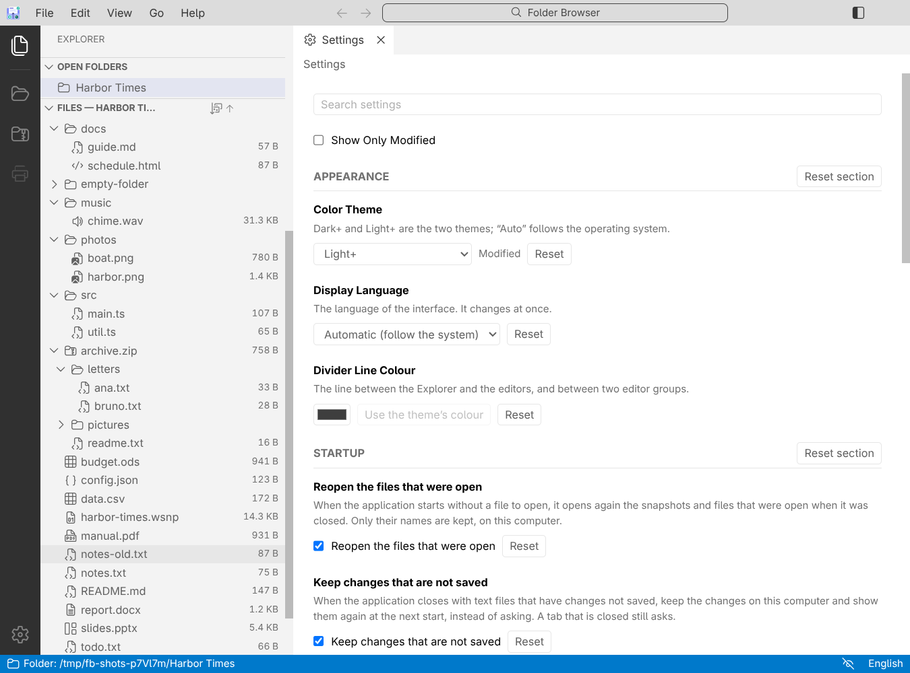

As **Configurações** (a engrenagem na barra de atividades, **Arquivo ▸ Preferências ▸ Configurações**, ou `Ctrl+,`) abrem numa aba com uma caixa que as filtra: **Tema de Cor** (Dark+, Light+ ou Auto), **Idioma de Exibição** (inglês, português do Brasil ou automático), se deve **reabrir o que estava aberto**, **Mostrar arquivos ocultos**, e para código **Quebra de Linha** e **Formatar arquivos de código**. As outras escolhas (Markdown, SVG, CSV, a ordem) são feitas onde são usadas, e também são guardadas. As configurações ficam no seu computador, na pasta do próprio aplicativo, e em nenhum outro lugar: veja [`../PRIVACY.md`](../PRIVACY.md).

**Ajuda ▸ Sobre o Folder Browser** mostra a versão, em que ele roda, a licença e os avisos das bibliotecas que há nele, e copia as informações de versão para um relato de erro. Relate um problema em <https://github.com/asantos43/folder-browser/issues>, **sem anexar um arquivo privado**; uma vulnerabilidade segue o que diz [`../SECURITY.md`](../SECURITY.md).

## O que ainda não existe

Mover ou copiar entre uma pasta e um arquivo ZIP (ou entre dois arquivos ZIP), acrescentar um arquivo do disco a um ZIP e editar os bytes de uma entrada de um ZIP ainda não existem (veja [`../TODO.md`](../TODO.md)). Selecionar várias linhas de uma vez (por isso a comparação se escolhe no menu, não com `Ctrl+clique`), comparar um arquivo com as alterações ainda não salvas na aba dele, mais de dois grupos de editor, arrastar para um lugar da barra lateral, e imprimir os bytes de um arquivo ou uma tabela como tabela também estão na lista.
